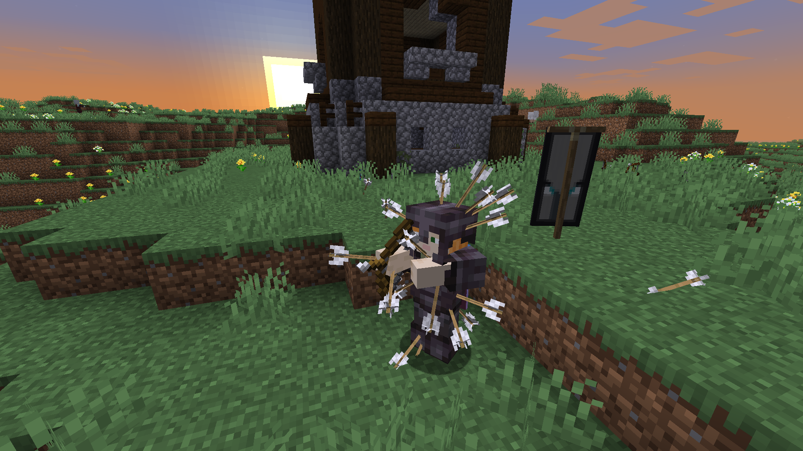

# Zerobrine 
The forgotten sister, defying her brother's curse with quiet light.


## What it does
* `follow Zerobrine <playerName>` – Zerobrine will follow the player
* `attack <playerName>` – Marks the player as hostile, Zerobrine will attack
* `stop` – Zerobine stops attacking 
* `stop <playerName>` – Removes that player from the hostile list
* `come at <x> <y> <z>` – Zerobrine walks to the given coordinates
* `sleep Zerobrine` - Zerobrine will sleep, finding the nearest bed or placing one from inventory (if placed, then after waking she breaks and again keeps it in the inventory).
* Default targets are zombies, skeletons, spiders, pillagers
* Automatically eats food when HP is low
* Equips the best armor and gear available in its inventory
* Uses bow for long-range attacks

The first 6 are chat commands that you have to enter in minecraft's chat, 7-10 are already defined in the code.

## Installation
Clone the repo and go into the folder:
```bash
git clone https://github.com/oceanthunder/Zerobrine
cd Zerobrine
````
Make sure you have Node.js and npm installed.
Then just run:
```bash
npm install
npm start
```

That’s it. Zerobrine should now connect to your Minecraft server (default is localhost:42069, you can change it in bot.js's host and port).


