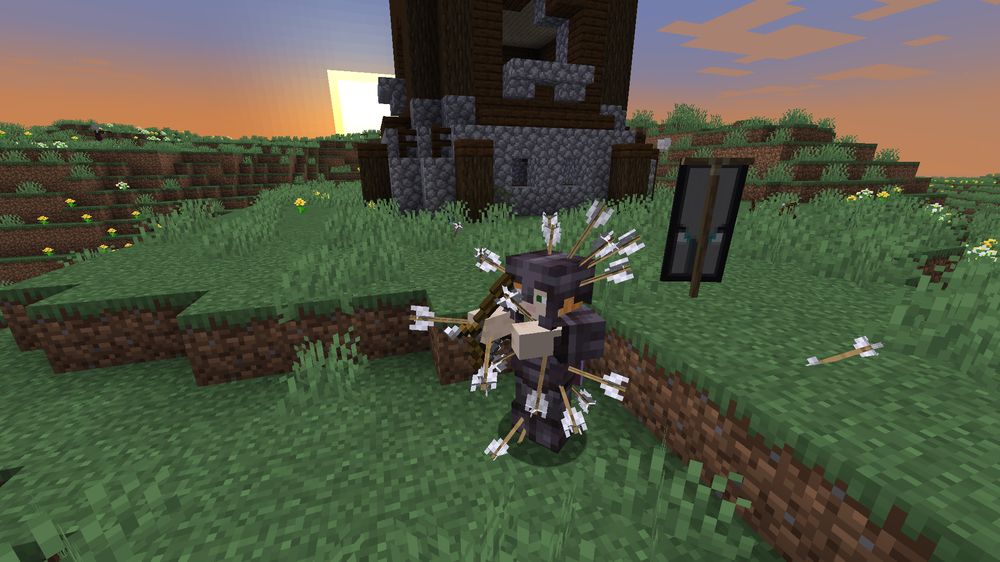

# Zerobrine 
The forgotten sister, defying her brother's curse with quiet light.


## How it works
Zerobrine connects to your Minecraft server via mineflayer, listens to chat commands, and has a free local LLM (Ollama phi4-mini) for natural language understanding.

When you type something in chat, Zerobrine either:
1. Recognizes a direct command (`!come`, `!follow`, `!attack`, etc.)
2. Sends it to the LLM which responds in character and may output an action command
3. Preprocesses it (e.g. "im at 65 70 -239" → auto goto)

## Chat Commands
* `follow Zerobrine <playerName>` – Zerobrine will follow the player
* `attack <playerName>` – Marks the player as hostile, Zerobrine will attack
* `stop` – Zerobine stops attacking 
* `stop <playerName>` – Removes that player from the hostile list
* `come at <x> <y> <z>` – Zerobrine walks to the given coordinates
* `sleep Zerobrine` - Zerobrine will sleep, finding the nearest bed or placing one from inventory (if placed, then after waking she breaks and again keeps it in the inventory).
* `drop ITEM` - Drops the said item 

These chat commands will be auto inferred by the LLM (given you don't make it sound tooo dumb). Eg: "Get your ass here Zerobrine" will prompt Zerobrine to arrive at your location.

## Behavior

* Default targets are zombies, skeletons, spiders, pillagers, breeze, bogged, zombie_nautilus, camel_husk, parched, zombie_horse
* Automatically eats food when HP is low
* Equips the best armor and gear available in its inventory
* Uses bow for long-range attacks

## Installation

### Prerequisites

Before you begin, make sure you have the following installed:

- **Java 21 (JRE OpenJDK)** – Required for running the Minecraft server.
- **Minecraft Java Edition 1.21.11** – The server must be running this version.
- **Node.js and npm** – Used to run the bot.
- **Ollama** – Local LLM for natural language understanding ([ollama.com](https://ollama.com)).

### Steps

1. Clone the repo and go into the folder:
```bash
git clone https://github.com/oceanthunder/Zerobrine
cd Zerobrine
```

2. Install the dependencies:
```bash
npm install
```

3. Make sure your Minecraft server is running on Java 21 (OpenJDK JRE) with version 1.21.11 and the server is in offline mode or the bot is whitelisted.

4. Start Ollama and pull the required model:
```bash
ollama pull phi4-mini
```

5. Start the bot:
```bash
npm start
```

That’s it. Zerobrine should now connect to your Minecraft server (default is localhost:42069, you can change it in bot.js's host and port).
